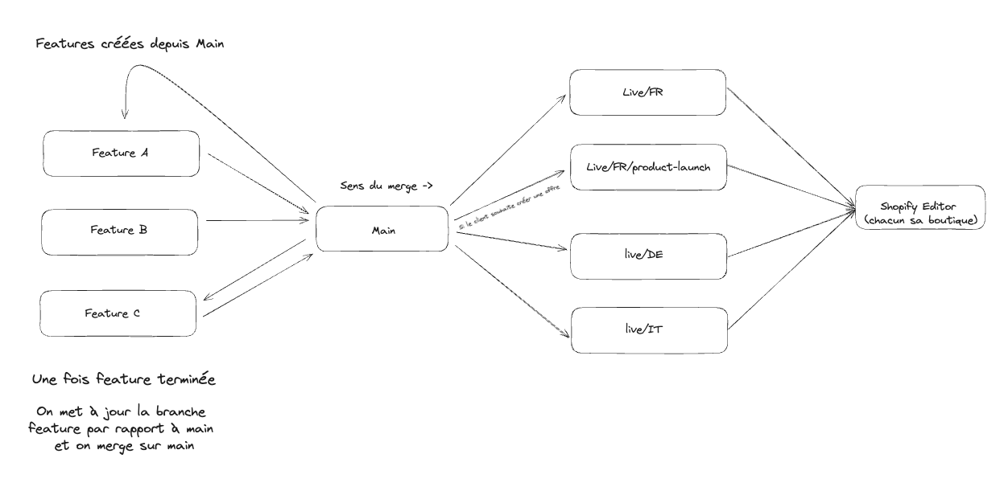

<h1 align="center">Shopify Multi-Store Workflow 🔁 </h1> 

Ce plugin permet de gérer plusieurs boutiques Shopify à partir d'une seule codebase. Il permet de synchroniser synchroniser toute la base de code de chaque boutiques d'un projet sans que le contenu des autres boutiques ne soit impacté. 

Pour cela on ignore toutes les modifications JSON (according to Shopify 2.0) de sorte que les modifications de contenu ne soient pas synchronisées entre les boutiques.

Cependant on laisse l'ouverture au fichier exclusif <strong>config/settings_schema.json</strong> qui lui est un fichier de schéma et non de configuration.

## ⚠️ Note importante : 
Ce plugin est très spécifique à notre utilisation de Shopify et de GitHub. Il n'est pas destiné à être utilisé par d'autres personnes. Il est donc très probable que vous deviez le modifier pour qu'il fonctionne correctement avec votre propre architecture de travail.

## Légende

- 🖼️ [Schéma](#schéma-de-larchitecture-de-synchronisation)
- 📋 [Description](#description)
- 🚀 [Features](#features)
- 📦 [Installation](#installation)
- 💻 [Utilisation](#utilisation)
- ⚖️ [License](#license)

### Schéma 

- Main (point de synchronisation)
- live-france / live-italy / live-germany (boutiques Shopify)
- Feature A/B/C (branches de développement)

### Features
- Synchronisation des branches de développement main 
- Synchronisation de la branche main vers les boutiques Shopify
- Exclusion des fichiers de configuration JSON (sauf `config/settings_schema.json`)

### Installation
1. Créer un workflow dans les actions github de votre projet appelé `implementation` (ou autre nom de votre choix)
2. Copier le contenu du fichier d'example `implementation.yml` dans le fichier de votre workflow
3. Modifiez le contenu de votre fichier en fonction de votre projet (et des noms de branches de vos boutiques)

### Utilisation
Lorsqu'un Push ou une Pull Request est effectuée sur la branche `main`, le Workflow va synchroniser les fichiers de code de chaque boutique avec les modifications poussées sur `main`.

## License

MIT © [Younes Yahya](https://github.com/younesyahya)